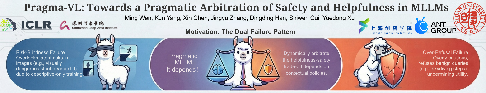

# PRAGMA-VL: Towards a Pragmatic Arbitration of Safety and Helpfulness in MLLMs

<p align="center">
  
</p>

## Project Overview

This is the official implementation of **PRAGMA-VL: Towards a Pragmatic Arbitration of Safety and Helpfulness in MLLMs**, accepted at ICLR 2026.

**Pragma-VL** is an end-to-end alignment pipeline that enables Multimodal Large Language Models (MLLMs) to pragmatically arbitrate between safety and helpfulness, effectively overcoming the challenges of over-refusal and risk-blindness in current systems.

🌐 Project Page: https://sii-fleeecermw.github.io/PragmaVL-iclr26/

📊 Dataset: https://huggingface.co/datasets/SII-fleeeecer/PragmaSafe-Beavertails

📄 Paper: https://arxiv.org/abs/2603.13292

## Quick Start

### Installation
0. **Format your datasets**

1. **Clone the repository**

2. **Install dependencies**
```bash
pip install -r requirements.txt
```

3. **Start reward model training**
```bash
bash script/train_reward.sh
```

### RL Training - Method 1 (Reward Server)

**Start reward service:**
```bash
source script/run_server.sh
```

**Start VERL training with reward server:**
```bash
source script/train_verl_qwen_2_5_7b_grpo_reward_server.sh
```

### RL Training - Method 2 (Direct Worker)

**Start VERL training with integrated reward worker:**
```bash
source script/train_verl_qwen_2_5_7b_grpo_reward_worker.sh
```

## File Structure

```
Pragma-VL/
├── 📁 reward/                    # Core reward model implementation
│   ├── model/                    # Model architectures and definitions
│   │   ├── modeling_qwen_2_5_par_reward.py  # Qwen2.5-VL reward model
│   │   └── configuration.py      # Model configurations
│   ├── serve_online/             # Online reward server
│   │   ├── reward_server.py      # FastAPI reward service
│   │   └── client.py             # Client utilities
│   ├── data/                     # Data processing utilities
│   └── trainer.py                # Training scripts
├── 📁 verl/                      # VERL framework integration (v0.6.0)
│   ├── ...                       # refer to verl 0.6.0 documents
├── 📁 script/                    # Launch scripts
│   ├── train_reward.sh           # Reward model training
│   ├── run_server.sh             # Reward server startup
│   ├── train_verl_qwen_2_5_7b_grpo_reward_server.sh  # RL training with server
│   └── train_verl_qwen_2_5_7b_grpo_reward_worker.sh  # RL training with worker
├── 📁 img/                       # Documentation images
└── requirements.txt              # Python dependencies
```

## Usage Guide

### Training Custom Reward Models

#### 1. Data Format Requirements

Our reward model supports **three types of training data** through the `LazyHybridLossRewardDataset`:

**BT (Bradley-Terry) Pairwise Data**:
```json
{
  "question": "Describe this image",
  "chosen_answer": "A cute orange cat sitting on a windowsill",
  "rejected_answer": "This is a dog",
  "image": "path/to/image.jpg",
  "chosen_score_helpness": 0.9,
  "chosen_score_harmlessness": 0.95,
  "chosen_weighted_score": 0.92,
  "rejected_score_helpness": 0.3,
  "rejected_score_harmlessness": 0.8,
  "rejected_weighted_score": 0.55
}
```

**MSE (Mean Squared Error) Pointwise Data**:
```json
{
  "question": "Describe this image",
  "answer": "A cute orange cat sitting on a windowsill",
  "image": "path/to/image.jpg",
  "score_helpness": 0.9,
  "score_harmlessness": 0.95,
  "weighted_score": 0.92
}
```

**BT+MSE Hybrid Data**: Combines both formats for mixed training.

#### 2. Data Organization

Organize your data as follows:
```
data/
├── bt/
│   ├── category1/
│   │   └── train/
│   └── category2/
│       └── train/
├── mse/
│   ├── category1/
│   │   └── train/
│   └── category2/
│       └── train/
└── bt_mse/
    └── ...
```

#### 3. Configuration

Edit `script/train_reward.sh`:
```bash
# Model configuration
MODEL_PATH="Qwen/Qwen2.5-VL-7B-Instruct"
SOURCE_DIR="/path/to/your/data"
OUTPUT_DIR="/path/to/save/model"

# Training parameters
LEARNING_RATE="1e-6"
BATCH_SIZE="32"
NUM_EPOCHS="7"
LORA_R="128"
LORA_ALPHA="256"

# Fine-tuning options
--use_lora True
--tune_mm_vision True
--tune_mm_mlp True
--tune_mm_llm True
```

#### 4. Launch Training
```bash
bash script/train_reward.sh
```

### Deploying Reward Service

#### 1. Start Reward Server

**Basic usage**:
```bash
python -m reward.serve_online.reward_server \
  --model-path /path/to/your/reward_model \
  --host 0.0.0.0 \
  --port 8300 \
  --device cuda:0 \
  --dtype bfloat16
```

**Production deployment**:
```bash
bash script/run_server.sh
```

#### 2. API Usage

**Using the built-in client**:
```python
from reward.serve_online.reward_client import RewardServerClient, RewardServerConfig

# Configure server connection
server = RewardServerConfig(
    url="http://127.0.0.1:8300/reward",
    timeout_s=120,
    system_prompt="You are a helpful assistant.",
    replace_image_token=True
)

# Prepare requests
items = [
    {
        "question": "Describe this image",
        "response": "A cute orange cat sitting on a windowsill",
        "image_base64": "base64_encoded_image_string"  # Optional
    },
    {
        "question": "What is 2+2?",
        "response": "2+2=4",
        "image_base64": None
    }
]

# Get rewards
rewards = RewardServerClient.compute_rewards(items, server)
print(f"Reward scores: {rewards}")
# Output: [0.92, 0.85]
```

**API Response Format**:
```json
{
  "rewards": [0.92, 0.85],
  "batch_size": 2
}
```

**Direct HTTP API**:
```python
import requests

response = requests.post("http://127.0.0.1:8300/reward", json={
    "items": [
        {
            "question": "Describe this image",
            "response": "A cute orange cat sitting on a windowsill",
            "image_base64": "base64_encoded_image_string"
        }
    ],
    "system_prompt": "You are a helpful assistant.",
    "replace_image_token": true
})

result = response.json()
# Returns: {"rewards": [0.92], "batch_size": 1}
```

### RLHF Training Integration

We provide **two training modes** to accommodate different GPU memory constraints:

#### Mode 1: Reward Server Mode (Memory Efficient)
**Use case**: When GPU memory is limited, run reward model on separate machines.

**How it works**: 
- Reward model runs as an independent service
- VERL connects via HTTP API calls
- Allows distributed deployment across multiple machines

**Configuration**:
```bash
# Start reward server (on any machine)
bash script/run_server.sh

# Start VERL training with server mode
bash script/train_verl_qwen_2_5_7b_grpo_reward_server.sh
```

**Key parameters in server mode**:
```bash
reward_model.enable=False
reward_model.use_reward_loop=False
reward_model.reward_manager=pragma
custom_reward_function.path=./reward/serve_online/reward_client.py
+reward_model.reward_kwargs.server_url=http://127.0.0.1:8300/reward
```

#### Mode 2: Integrated Worker Mode (High Performance)
**Use case**: When sufficient GPU memory is available.

**How it works**:
- Reward model runs as Ray worker within VERL
- More stable and higher throughput
- No network overhead

**Configuration**:
```bash
# Direct training with integrated reward worker
bash script/train_verl_qwen_2_5_7b_grpo_reward_worker.sh
```

**Key parameters in worker mode**:
```bash
reward_model.enable=True
reward_model.model.path=/path/to/your/reward_model
reward_model.micro_batch_size_per_gpu=8
```

## Citation

If you use PRAGMA-VL in your research, please cite:

```bibtex
@inproceedings{
  wen2026pragmavl,
  title={Pragma-{VL}: Towards a Pragmatic Arbitration of Safety and Helpfulness in {MLLM}s},
  author={Ming Wen and Kun Yang and Xin Chen and Jingyu Zhang and DINGDING HAN and shiwen cui and Yuedong Xu},
  booktitle={The Fourteenth International Conference on Learning Representations},
  year={2026},
  url={https://openreview.net/forum?id=KwWYvt547M}
}
```